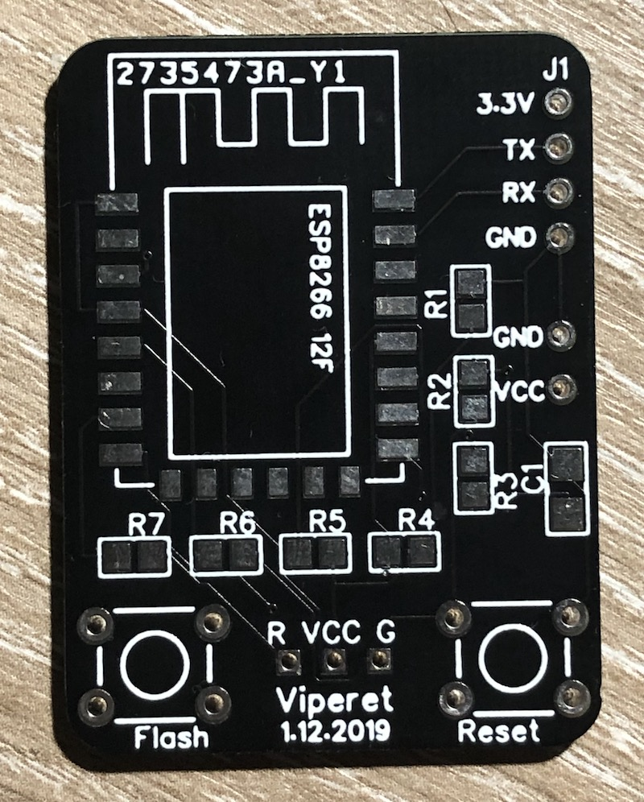
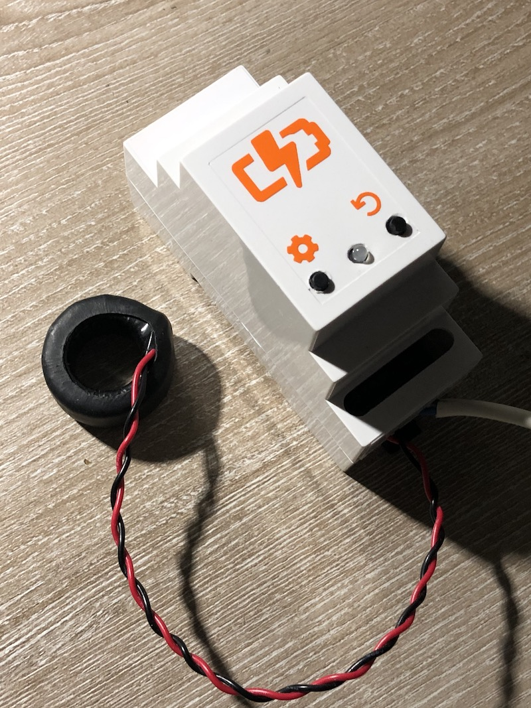
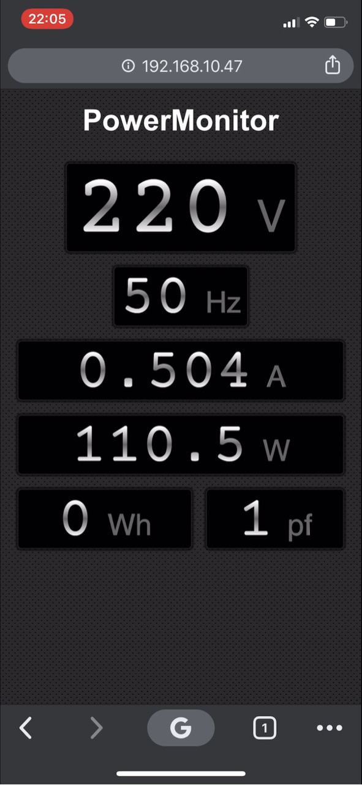

# esp8266-power-monitor
DIY Power Monitor project using PZEM-004T module and ESP-12F

PCB manufactured at JLCPCB

Device assembled in the DIN-rail enclosure

Web UI updates data every second using Websockets connection.

## Dependencies

- [Adafruit MQTT Library](https://github.com/adafruit/Adafruit_MQTT_Library)
- [PZEM-004T-v30](https://github.com/mandulaj/PZEM-004T-v30)
- [WifiManager](https://github.com/tzapu/WiFiManager)
- [Blinker](https://github.com/MajenkoLibraries/Blinker)
- [OneButton](https://github.com/mathertel/OneButton)
- [Websockets](https://github.com/Links2004/arduinoWebSockets)